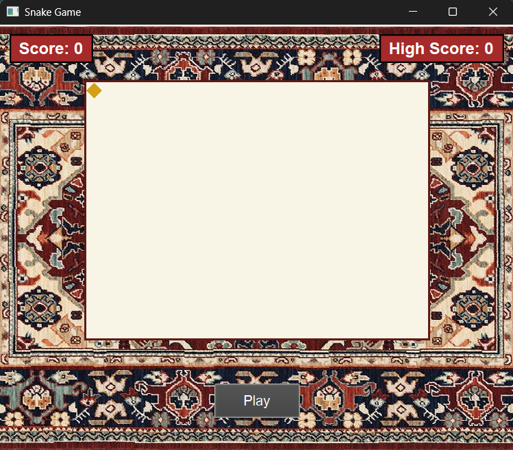

# 🐍 Qt Snake Game

[](https://www.qt.io/)
[](https://opensource.org/licenses/MIT)
[](https://isocpp.org/)

A classic Snake game implementation using Qt framework with modern UI features and smooth gameplay.

<p align="center">
  
</p>

## ✨ Features

- 🕹️ Intuitive controls (WASD or Arrow keys)
- 📊 Score system with persistent high score saving
- ⚡ Dynamic game speed acceleration as you progress
- 🎨 Visually appealing design with:
- 🐍 Triangular snake head that changes direction
- 🌳 Alternating body segment colors
- 🍪 Golden food items
- 🏞 Custom background (sand color fallback)
- ⏸️ Automatic pause when window loses focus
- 🔄 Restart functionality with dedicated button
- 🖌️ Custom rendering using QPainter

## 🛠️ Building the Project

### Prerequisites
- Qt 5.12 or later
- C++11 compatible compiler
- CMake (optional)

### Build Instructions
```bash
git clone https://github.com/pashayevan/SnakeGame-Qt.git
cd SnakeGame-Qt
cd build
```

### For Windows with MinGW:
```bash
qmake -spec win32-g++ 
mingw32-make
```

### 🎮 How to Play

1.Launch the game

2.Click "Play" button or any of the control buttons on keypad

3.Use arrow keys to control the snake

4.Eat the golden food to grow and score points

5.Avoid walls and your own tail

6.Game speeds up every 5 points

### 🏗️ Project Structure
```bash
qt-snake-game/
├── snake.h          # Main game class declaration
├── snake.cpp        # Game logic implementation
├── main.cpp         # Application entry point
├── CMakeLists.txt   # CMake build configuration
└── resources/       # (Optional) Asset directory

```

### 🧠 Technical Details
Core Components
> SnakeGame (QWidget subclass) - Main game window

> QTimer - Game loop controller

> QPainter - Custom rendering engine

> QSettings - Persistent high score storage

## 🎨 Color Palette

| Element         | Hex Code  | Sample |
|-----------------|-----------|--------|
| Background      | `#F0E5D8` | 🟫      |
| Snake Head      | `#5E1914` | 🟤      |
| Body Segment 1  | `#8B4513` | 🟫      |
| Body Segment 2  | `#A0522D` | 🟤      |
| Food            | `#D4A017` | 🟨      |
| Borders         | `#5E1914` | 🟤      |

### Key Algorithms
```cpp
// Simplified game loop
void SnakeGame::gameLoop() {
    if (!gameRunning) return;
    
    // Movement logic
    QPoint head = snake.first();
    switch (direction) {
        case 0: head.ry()--; break; // Up
        case 1: head.rx()++; break; // Right
        case 2: head.ry()++; break; // Down
        case 3: head.rx()--; break; // Left
    }
    
    // Collision detection
    if (head.x() < 0 || head.x() >= FIELD_WIDTH || 
        head.y() < 0 || head.y() >= FIELD_HEIGHT) {
        gameOver();
    }
    
    // Food consumption
    if (head == food) {
        score++;
        generateFood();
    } else {
        snake.removeLast();
    }
    
    update();
}
```


